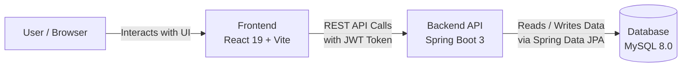

# Workforce Automation Portal (WAP)

[](https://spring.io/projects/spring-boot)
[](https://react.dev/)
[](http://localhost:8080/swagger-ui.html)
[](https://vitejs.dev/)
[](https://www.mysql.com/)

**Workforce Automation Portal (WAP)** is an enterprise workforce and human resource management platform. Designed for modern organizations, WAP unifies employee administration, time and attendance tracking, leave approvals, payroll computation, project allocation, and inter-departmental direct messaging into a cohesive, secure, and responsive application.

---

## System Architecture



### High-Level Flow
1. **Frontend (React 19 + Vite)**: Provides responsive UI dashboards for Admin, HR, and Employees.
2. **Backend API (Spring Boot 3)**: Handles REST endpoints, role-based authorization, JWT security, and business logic.
3. **Database (MySQL)**: Stores users, attendance records, leave applications, payroll, and projects.

---

## Role-Based Features

### 1. System Administration (ROLE_ADMIN)
- **Real-Time Analytics Dashboard**: Organization-wide metrics including workforce headcount, live attendance distribution, leave requests, and department breakdowns.
- **Dynamic Roles and Feature Permissions Matrix**: Fine-grained access control to toggle and enforce module privileges across HR and Employee tiers in real-time.
- **Staff and User Directory**: Create, update, activate, or suspend employee records with cascade-safe relational deletion.
- **Company and System Preferences**: Configurable organization name, timezone (IST/EST/GMT), standard shift hours, and security configurations with persistent storage.
- **Audit Logging**: Comprehensive traceability of security-sensitive administrative actions.

### 2. HR Management (ROLE_HR)
- **Employee Lifecycle Directory**: Departmental roster, designations, contact management, and status updates.
- **Attendance Monitoring**: Organization-wide daily attendance logs, punctuality tracking, and exportable records.
- **Leave Request Processing**: Real-time review, approval, or rejection of time-off submissions with automated balance adjustments.
- **Payroll Processing**: Automated monthly payroll generation, salary structure calculation (Basic, HRA, Allowances, PF, Tax, Deductions), and payslip generation.
- **Project Allocation**: Track company initiatives, project milestones, priorities, and assigned team members.

### 3. Standard Employee (ROLE_EMPLOYEE)
- **Self-Service Dashboard**: Personal attendance metrics, upcoming leaves, current project workload, and direct company announcements.
- **Time and Attendance Tracking**: One-click check-in / check-out with automatic total work duration calculation.
- **Leave Management**: Submit leave applications (Casual, Sick, Annual), monitor approval status, and track real-time leave balances.
- **Salary and Payslips**: Transparent salary slip view with detailed earnings and deductions breakdown.
- **Personal Information**: Self-service profile management, contact details, and secure password updates.

### 4. Direct Messaging and AI Assistant
- **Direct Messaging**: Role-based internal messaging system allowing real-time communication between Admin, HR, and Employees.
- **AI Assistant**: Built-in Groq AI Chatbot widget for answering workplace and portal queries.

---

## Security Features

- **BCrypt Password Hashing**: Passwords stored using Spring Security's `BCryptPasswordEncoder`.
- **JWT Authentication**: Secure HMAC-SHA256 tokens for stateless authentication.
- **Rate Limiting**: Built-in Token Bucket rate limiting on authentication endpoints to mitigate brute-force attempts.
- **Global Exception Handling**: Centralized exception handler guarantees unified JSON responses without leaking internal stack traces.
- **Input Validation**: Jakarta Bean Validation (`@Valid`, `@NotBlank`, `@Email`, `@Size`, `@Min`) returning structured field-level error messages.
- **OpenAPI Documentation**: Interactive Swagger UI with Bearer JWT support accessible at `/swagger-ui.html`.

---

## Getting Started

### Prerequisites
- **Java JDK 17+**
- **Node.js 18+** and **npm**
- **MySQL Server 8.0+**

### Step 1: Database Setup
MySQL will automatically create the database `wap_db` on first launch. If creating manually:
```sql
CREATE DATABASE IF NOT EXISTS wap_db;
```

### Step 2: Run the Spring Boot Backend
```bash
cd WAP-Backend
mvn spring-boot:run
```
- API Base URL: `http://localhost:8080/api`
- Interactive Swagger UI: `http://localhost:8080/swagger-ui/index.html`

### Step 3: Run the React Frontend
```bash
cd frontend
npm install
npm run dev
```
Open `http://localhost:5173` in your browser.
