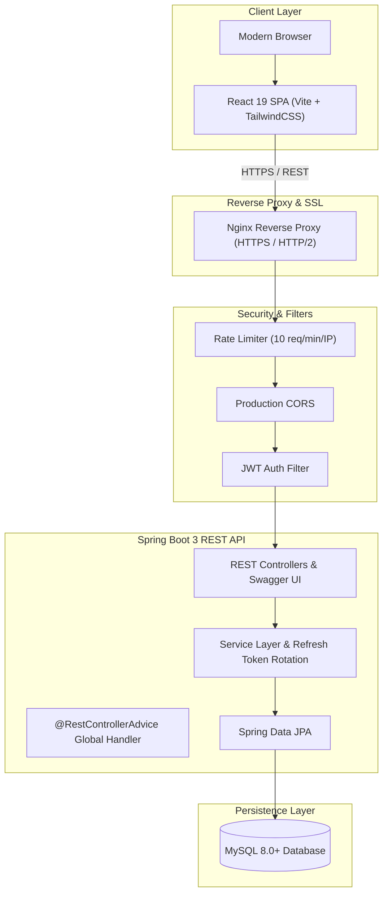

# Workforce Automation Portal (WAP)

[](https://spring.io/projects/spring-boot)
[](https://react.dev/)
[](http://localhost:8080/swagger-ui.html)
[](https://vitejs.dev/)
[](https://www.mysql.com/)
[](https://opensource.org/licenses/MIT)

**Workforce Automation Portal (WAP)** is an enterprise-grade workforce and human resource management platform. Designed for modern organizations, WAP unifies employee administration, time & attendance tracking, leave approvals, payroll computation, project allocation, and inter-departmental direct messaging into a cohesive, secure, and responsive application.

---

## 🏛️ System Architecture



For complete architecture specifications, authentication flows, and data models, see [docs/ARCHITECTURE.md](docs/ARCHITECTURE.md).

---

## 🌟 Key Highlights & Role Features

### 👑 1. System Administration (`ROLE_ADMIN`)
- **Real-Time Analytics Dashboard**: Organization-wide metrics including workforce headcount, live attendance distribution, leave requests, and department breakdowns.
- **Dynamic Roles & Feature Permissions Matrix**: Fine-grained access control to toggle and enforce module privileges across HR and Employee tiers in real-time.
- **Staff & User Directory**: Create, update, activate, or suspend employee records with cascade-safe relational deletion.
- **Company & System Preferences**: Configurable organization name, timezone (IST/EST/GMT), standard shift hours, and security configurations with persistent storage.
- **Audit Logging**: Comprehensive traceability of security-sensitive administrative actions.

### 💼 2. HR Management (`ROLE_HR`)
- **Employee Lifecycle Directory**: Departmental roster, designations, contact management, and status updates.
- **Attendance Monitoring**: Organization-wide daily attendance logs, punctuality tracking, and exportable records.
- **Leave Request Processing**: Real-time review, approval, or rejection of time-off submissions with automated balance adjustments.
- **Payroll Processing**: Automated monthly payroll generation, salary structure calculation (Basic, HRA, Allowances, PF, Tax, Deductions), and payslip generation.
- **Project Allocation**: Track company initiatives, project milestones, priorities, and assigned team members.

### 👤 3. Standard Employee (`ROLE_EMPLOYEE`)
- **Self-Service Dashboard**: Personal attendance metrics, upcoming leaves, current project workload, and direct company announcements.
- **Time & Attendance Tracking**: One-click check-in / check-out with automatic total work duration calculation.
- **Leave Management**: Submit leave applications (Casual, Sick, Annual), monitor approval status, and track real-time leave balances.
- **Salary & Payslips**: Transparent salary slip view with detailed earnings and deductions breakdown.
- **Personal Information**: Self-service profile management, contact details, and secure password updates.

### 📬 4. Cross-Organization Direct Messaging
- Role-based internal messaging system allowing real-time communication between Admin, HR, and Employees.

---

## 🔒 Enterprise Security Features

- **BCrypt Password Hashing**: Passwords stored using Spring Security's `BCryptPasswordEncoder` with 10 salt rounds.
- **Short-Lived Access Tokens + Refresh Token Rotation**: 15-minute JWT access tokens paired with 7-day database-backed rotating refresh tokens (`/api/auth/refresh`).
- **Rate Limiting on Auth Endpoints**: Built-in in-memory Token Bucket rate limiter (10 requests/minute/IP) on `/api/auth/**` returning HTTP 429 to mitigate brute-force attacks.
- **Global Exception Handling**: `@RestControllerAdvice` guarantees unified JSON responses without leaking internal stack traces.
- **Input Validation**: Jakarta Bean Validation (`@Valid`, `@NotBlank`, `@Email`, `@Size`, `@Min`) returning HTTP 400 with structured field-level error messages.
- **Production CORS**: Configurable allowed origins, explicit HTTP methods, headers, and credential support.
- **OpenAPI 3.0 Documentation**: Interactive Swagger UI with Bearer JWT support accessible at `/swagger-ui.html`.

---

## 🚀 Quick Start Guide

### Option A: One-Command Startup with Docker Compose (Recommended)

Spin up the complete production-like stack (**MySQL 8.0 + Spring Boot Backend + Nginx/React Frontend**) with a single command:

```bash
docker compose up --build
```

- **Frontend Web App**: [`http://localhost`](http://localhost) (Port 80)
- **Backend API**: [`http://localhost:8080/api`](http://localhost:8080/api)
- **Interactive Swagger UI**: [`http://localhost:8080/swagger-ui.html`](http://localhost:8080/swagger-ui.html)
- **MySQL Database**: `localhost:3306`

To shut down:
```bash
docker compose down
```

---

### Option B: Local Development (Without Docker)

#### Prerequisites
- **Java JDK 17+**
- **Node.js 18+** and **npm**
- **MySQL Server 8.0+**

#### Step 1: Database Setup
Open MySQL and execute:
```sql
CREATE DATABASE IF NOT EXISTS wap_db;
```

#### Step 2: Configure Environment Variables
Copy the example configuration:
```bash
cp .env.example .env
```
Ensure your MySQL credentials match in `.env` or `WAP-Backend/src/main/resources/application.properties`.

#### Step 3: Run the Spring Boot Backend
```bash
cd WAP-Backend
# Windows
.\mvnw.cmd spring-boot:run
# macOS / Linux
./mvnw spring-boot:run
```
- API Base URL: `http://localhost:8080/api`
- Interactive Swagger UI: `http://localhost:8080/swagger-ui.html`

#### Step 4: Run the React Frontend
```bash
cd frontend
npm install
npm run dev
```
Open **`http://localhost:5173`** in your browser.

---

## 🚢 Production Deployment

For complete production deployment, Nginx SSL reverse proxy configuration, Let's Encrypt Certbot setup, Systemd, and Docker architecture guides, refer to [DEPLOYMENT.md](DEPLOYMENT.md).

---

## 📄 License
This project is licensed under the [MIT License](LICENSE).

