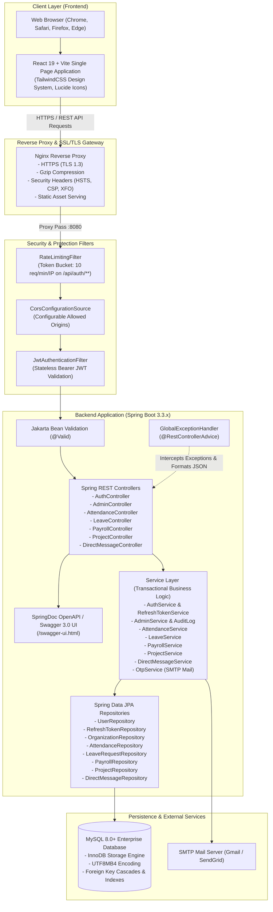
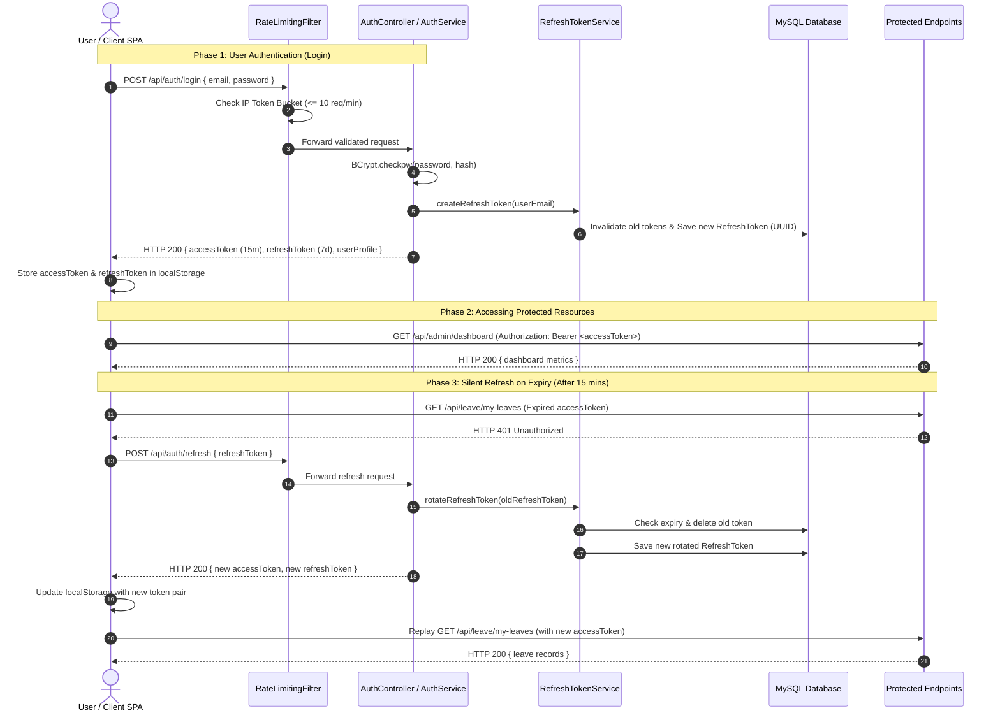
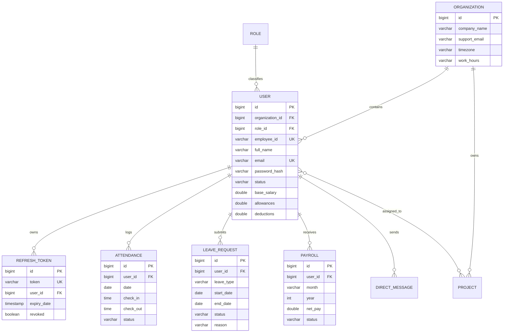

# Workforce Automation Portal (WAP) — Architecture & System Design

This document describes the high-level system architecture, authentication & token rotation lifecycle, security model, and role-based access control (RBAC) implementation for the Workforce Automation Portal.

---

## 1. High-Level System Architecture

---

## 2. Authentication & Token Rotation Flow

WAP implements a hardened token architecture consisting of:
- **Short-Lived JWT Access Token (15 Minutes)**: Used for stateless authorization on protected endpoints.
- **Database-Backed Rotating Refresh Token (7 Days)**: Single-use token rotated on every refresh call to prevent replay attacks.

---

## 3. Role-Based Access Control (RBAC) Matrix

| Module / Endpoint | Anonymous | ROLE_EMPLOYEE | ROLE_HR | ROLE_ADMIN |
| :--- | :---: | :---: | :---: | :---: |
| **Authentication** (`/api/auth/login`, `/register-org`, `/send-otp`) | ✅ | ✅ | ✅ | ✅ |
| **Silent Refresh** (`/api/auth/refresh`) | ✅ | ✅ | ✅ | ✅ |
| **API Documentation** (`/swagger-ui.html`, `/v3/api-docs/**`) | ✅ | ✅ | ✅ | ✅ |
| **Employee Self Check-in/Out** (`/api/attendance/check-in`, `/check-out`) | ❌ | ✅ | ✅ | ✅ |
| **Leave Applications** (`/api/leave/submit`, `/my-leaves`) | ❌ | ✅ | ✅ | ✅ |
| **My Payslips** (`/api/payroll/my-payslips`) | ❌ | ✅ | ✅ | ✅ |
| **Projects Team View** (`/api/projects`, `/team-stats`) | ❌ | ✅ | ✅ | ✅ |
| **Direct Messaging** (`/api/messages/**`) | ❌ | ✅ | ✅ | ✅ |
| **HR Org Attendance** (`/api/attendance/org-today`) | ❌ | ❌ | ✅ | ✅ |
| **HR Leave Approvals / Rejections** (`/api/leave/hr/**`) | ❌ | ❌ | ✅ | ✅ |
| **HR Batch Payroll Processing** (`/api/payroll/hr/generate`) | ❌ | ❌ | ✅ | ✅ |
| **User Directory & Creation** (`/api/admin/users`) | ❌ | ❌ | ✅ | ✅ |
| **User Deletion & Cascade Clean** (`DELETE /api/admin/users/{id}`) | ❌ | ❌ | ❌ | ✅ |
| **Role & Permission Customization** (`/api/admin/roles/permissions`) | ❌ | ❌ | ❌ | ✅ |
| **Organization Settings & Timezone** (`/api/admin/settings`) | ❌ | ❌ | ❌ | ✅ |
| **System Audit Logs** (`/api/admin/audit`) | ❌ | ❌ | ❌ | ✅ |

---

## 4. Database Entity Relationships

